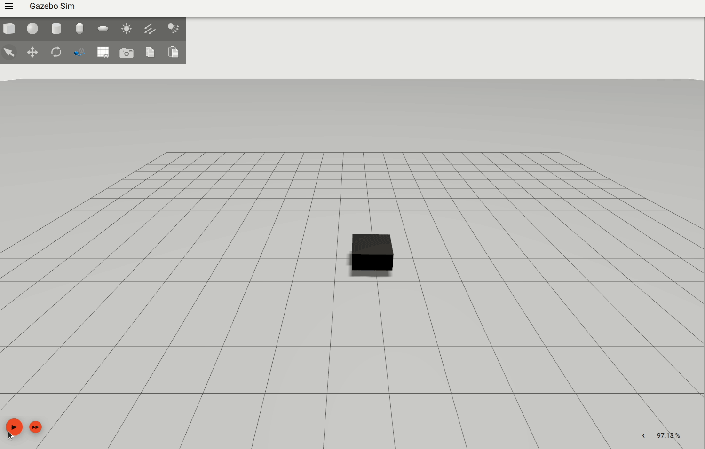

# MoveModel Plugin 

**Description** : Use to animate models in gazebo simulation. Specify the time stamped waypoints in sdf file and the animation is created based on the mentioned keyframes. 

## Build

To build the plugin from the root of the repository run :

```
cd simulator_ws/src/underwater_sim/underwater_plugins/MoveModel
mkdir build
cd build
cmake ..
make
```
And add the library to the path 
```
cd simulator_ws/src/underwater_sim/underwater_plugins/MoveModel
export GZ_SIM_SYSTEM_PLUGIN_PATH=`pwd`/build
```

## Usage 

To use the plugin add the following tag with the respective waypoints to the model tag in the sdf

```
<plugin filename="MoveModel" name="move_model::MoveModel">
    <waypoint>
        <time>0</time>
        <pose>0 0 1 0 0 0.7</pose>
    </waypoint>
    <waypoint>
        <time>10</time>
        <pose>-5 -5 1 0 0.7 0</pose>
    </waypoint>
    .
    .
    .
    <waypoint>
    <time>25</time>
    <pose>5 -5 6 1.54 0 0</pose>
    </waypoint>
</plugin>
```

## Example

A box model animated using the plugin 
